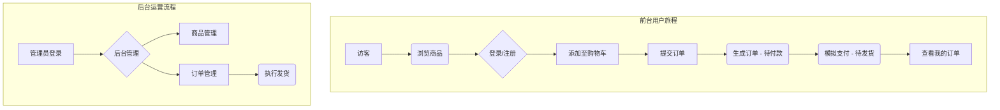

# 商城系统需求文档（基于 `mall` 源码）

> 文档版本：v1.0
> 生成日期：2026-01-02
> 适用代码仓库：mall-master（Spring Boot 1.5.8）

本需求文档完全依据实际源码结构、实体模型及控制器路由编写，确保所述范围与实现一致。

---

## 1. 项目概述

商城系统提供一个 B2C 单商户电子商务解决方案，包含前台商城与后台运营两大子系统。系统采用 JPA + Thymeleaf 的 MVC 单体架构，支持商品浏览、购物车、下单支付、订单跟踪以及后台的 CRUD 运维能力。

## 2. 需求分析

### 2.1 业务背景与市场痛点
随着电子商务的普及，众多中小型企业面临着线上转型的迫切需求。然而，市面上的主流电商解决方案存在以下痛点：
- **SaaS 平台成本高昂**：成熟的 SaaS 电商平台（如 Shopify、有赞）通常伴随着较高的月费、年费及交易抽成，对初创企业构成了一定的经济压力。
- **定制化能力受限**：SaaS 平台提供的模板和功能虽然丰富，但在深度定制、二次开发以及与企业自有系统（如 ERP、CRM）集成方面存在诸多限制。
- **数据归属与安全担忧**：企业核心的交易数据和用户数据留存在第三方平台，存在一定的安全与主权风险。

本项目旨在解决以上痛点，提供一套**开源、可私有化部署、易于二次开发**的 B2C 电商系统骨架，帮助开发者和中小型企业以更低的成本、更高的自主性快速构建自有品牌的线上商城。

### 2.2 项目目标
本项目的核心目标是实现一个功能完备、安全可靠、体验流畅的单商户 B2C 电商平台。具体可量化目标如下：

| 维度 | 目标描述 | 衡量指标 |
|---|---|---|
| **用户体验** | 提供无缝的购物流程 | - 新用户从注册到成功下单的平均时长 < 2分钟<br>- 页面平均加载时间 (LCP) < 2.5秒 |
| **运营效率** | 简化后台管理操作 | - 运营人员从登录到成功上架一个新商品的操作步骤 < 3步<br>- 订单发货操作能在 30 秒内完成 |
| **系统性能** | 保证高并发下的稳定性 | - 单机部署支持 ≥200 并发用户浏览<br>- 单机部署支持 ≥20 并发下单 |
| **安全性** | 保障用户数据和交易安全 | - 用户密码采用 BCrypt 加盐哈希存储<br>- 关键操作（如下单、支付）需登录态验证<br>- 防止常见的 Web 攻击（SQL注入、XSS、CSRF） |

### 2.3 目标用户与典型场景（User Stories）

| 角色 | 典型场景描述 |
|---|---|
| **消费者/访客** | 作为一个网站访客，我希望**无需登录即可浏览**首页、商品分类和商品详情，以便快速了解商城内容。 |
| **注册用户** | 作为一个注册用户，我希望能够将心仪的商品**加入购物车**，并在后续方便地进行**结算、下单和支付**，完成购物。 |
| **注册用户** | 作为一个已下单的用户，我希望能够随时**查看我的订单列表、订单详情以及订单状态**（本项目为模拟），以便跟踪我的购物情况。 |
| **后台运营人员** | 作为一个运营人员，我需要一个直观的后台界面，让我可以方便地**新增、编辑、上架/下架商品**，并管理商品的**分类和图片**。 |
| **后台客服/管理员** | 作为一个客服人员，我需要能够**查询所有用户的订单**，查看订单详情，并执行**“发货”**等状态变更操作，以完成订单履约。 |

### 2.4 业务流程概览



### 2.5 约束与假设
- **单商户模式**：系统不涉及多店铺、供应商入驻等复杂场景。
- **模拟支付与物流**：支付和发货流程仅做状态变更，未对接真实的第三方支付网关或物流查询接口。
- **部署环境**：默认部署于企业内网或单一服务器，未考虑分布式、高可用集群等复杂架构。
- **安全基线**：已实现基础的 Web 安全防护（见鲁棒性章节），但未达到金融级安全标准。

## 3. 系统角色

1. **游客**：未登录状态浏览商品、查看首页与分类页。
2. **普通用户**：注册/登录后可执行购物车、下单、支付、查看订单、确认收货等操作。
3. **后台管理员**：登录后台后进行商品、分类、订单、用户的维护与运营。

## 4. 功能范围

本系统的功能范围主要划分为两大模块：面向终端消费者的**前台商城门户（Mall Portal）**和面向内部运营人员的**后台管理系统（Admin Console）**。下文将对这两大模块的核心功能进行详细归纳，并随后基于实际代码实现逐一展开。

### 前台功能范围概述 (Mall Portal)

前台系统深度聚焦用户的购物体验，构建了从“发现商品”到“完成购买”再到“售后跟踪”的完整用户旅程。其核心功能可归纳为以下几个阶段：

1.  **浏览与发现 (Discovery & Browsing)**：
    *   **首页门户**：作为商城的入口，通过展示“热门商品”和“最新商品”吸引用户，引导流量。
    *   **分类导航**：提供清晰的一级、二级商品分类体系，方便用户按需查找。
    *   **商品搜索** (注：本项目简化为按分类浏览)：用户可以快速定位到感兴趣的商品类目。

2.  **兴趣与决策 (Interest & Decision)**：
    *   **商品详情页**：提供商品的多角度图片、详细描述、市场价与本店价，帮助用户做出购买决策。
    *   **用户认证**：支持用户注册新账户和登录现有账户，为后续个性化服务（如购物车、订单）提供基础。

3.  **购买与支付 (Purchase & Payment)**：
    *   **购物车管理**：用户可将多个商品加入购物车，并进行数量修改或删除。购物车数据与用户会话绑定。
    *   **订单提交**：从购物车一键结算，填写收货地址、联系方式后生成订单。
    *   **模拟支付**：为简化流程，支付环节仅做状态变更，模拟支付成功的场景。

4.  **售后与管理 (Post-purchase & Management)**：
    *   **订单中心**：用户可查看自己的历史订单列表、订单详情（包含商品、数量、总价）以及当前订单状态。
    *   **确认收货**：用户在收到商品后，可手动确认收货，完成整个交易闭环。

### 后台功能范围概述 (Admin Console)

后台系统是整个商城的运营核心，为管理员提供了对商城核心业务数据和流程的全面管控能力。其功能主要围绕以下几个核心管理模块：

1.  **商品管理 (Product Management)**：
    *   **商品信息维护 (CRUD)**：支持商品的增、删、改、查，包括商品标题、描述、价格、图片等关键信息的录入与编辑。
    *   **商品上架与分类**：可将商品归入特定的二级分类，并设置为“热门商品”以在首页推荐。

2.  **分类管理 (Category Management)**：
    *   **层级化管理**：支持一级和二级分类的创建、修改与删除，构建清晰的商品导航体系。

3.  **订单管理 (Order Management)**：
    *   **订单履约**：管理员可查看所有用户的订单列表，并对“待发货”的订单执行“发货”操作，推进订单状态流转。
    *   **订单查询与详情**：支持按分页查询订单，并能查看每个订单包含的具体商品项。

4.  **用户管理 (User Management)**：
    *   **用户信息维护**：管理员可以查看所有注册用户的列表，并对单个用户的信息进行编辑或删除。

下文基于实际 Controller / Service 实现对各模块进行逐项说明。

### 4.1 前台功能 (`priv.jesse.mall.web.user`)

| 功能             | 详细说明                                   | 入口 / 接口                                                                           |
| ---------------- | ------------------------------------------ | ------------------------------------------------------------------------------------- |
| 首页             | 首页静态内容展示、热门商品和最新商品组件   | `IndexController` → `/index.html`                                                |
| 用户注册         | 输入用户名、密码、联系方式，唯一性校验     | `UserController.toRegister` `/user/toRegister.html<br>`提交 `/user/register.do` |
| 用户登录         | 表单登录，成功后 Session 保存 `user`     | `/user/toLogin.html` & `/user/login.do`                                           |
| 用户登出         | 清理 Session 并重定向首页                  | `/user/logout.do`                                                                   |
| 用户名检查       | AJAX 检测用户名是否存在                    | `/user/checkUsername.do` 返回 `ResultBean<Boolean>`                               |
| 商品详情         | 根据商品 ID 展示详情页                     | `ProductController.toProductPage` `/product/get.html?id=`                         |
| 商品查询 – 热门 | 查询 `isHot=1` 商品集合                  | `/product/hot.do`                                                                   |
| 商品查询 – 最新 | 分页获取最新上架商品                       | `/product/new.do?pageNo=&pageSize=`                                                 |
| 分类浏览         | 根据一级或二级分类分页浏览商品             | `/product/category.do`、`/product/categorySec.do`                                 |
| 二级分类列表     | 根据一级分类获取所有二级分类               | `/product/getCategorySec.do`                                                        |
| 购物车 – 添加   | 将商品加入购物车（存 Session）             | `/product/addCart.do`                                                               |
| 购物车 – 移除   | 从购物车删除商品                           | `/product/delCart.do`                                                               |
| 购物车 – 查看   | 返回 Session 中购物车条目                  | `/product/listCart.do`                                                              |
| 下单提交         | 依据购物车生成订单（含收货人信息）         | `OrderController.submit` `/order/submit.do`                                       |
| 订单列表         | 展示当前登录用户所有订单                   | `/order/toList.html` & `/order/list.do`                                           |
| 订单详情         | 查询指定订单的订单项                       | `/order/getDetail.do`                                                               |
| 订单支付         | 调用 `OrderService.pay` 修改状态为已支付 | `/order/pay.do`                                                                     |
| 订单收货         | 用户确认收货，状态流转至已完成             | `/order/receive.do`                                                                 |

### 4.2 后台功能 (`priv.jesse.mall.web.admin`)

| 功能         | 详细说明                                              | 入口 / 接口                                   |
| ------------ | ----------------------------------------------------- | --------------------------------------------- |
| 管理员登录   | 表单登录、Session 保存 `login_user`                 | `/admin/toLogin.html` & `/admin/login.do` |
| 首页仪表盘   | 后台首页静态模板                                      | `/admin/toIndex.html`                       |
| 用户管理     | 分页查询、编辑、删除用户                              | `AdminUserController` 下多接口              |
| 商品管理     | 添加、编辑(含图片上传)、删除、分页查询商品            | `AdminProductController` 下多接口           |
| 商品图片下载 | `/admin/product/img/{filename}` 访问 `file/` 目录 |                                               |
| 分类管理     | 一级、二级分类增删改查与分页                          | `AdminClassificationController`             |
| 订单管理     | 分页查询订单、查看明细、发货                          | `AdminOrderController`                      |

### 4.3 通用与系统功能

| 组件                       | 作用                                  | 说明                                          |
| -------------------------- | ------------------------------------- | --------------------------------------------- |
| 统一返回 `ResultBean<T>` | 前后端通信包装类                      | `entity.pojo` 包                            |
| AOP 日志                   | 请求/响应日志切面                     | `WebLogAspect`                              |
| 全局异常处理               | 捕获业务异常并跳转 `error.html`     | `GlobalExceptionHandler`                    |
| 登录过滤器                 | 拦截后台 & 用户敏感 URI，校验 Session | `AuthorizationFilter`                       |
| BCrypt 密码加密            | 用户和管理员密码加盐哈希存储          | `UserServiceImpl`, `AdminUserServiceImpl` |
| 文件存储工具               | 保存上传商品图片到 `file/` 目录     | `utils.FileUtil`                            |

## 5. 实体与状态

### 5.1 主要实体

| 实体           | 字段摘要                                                                     |
| -------------- | ---------------------------------------------------------------------------- |
| User           | id, username, password, name, phone, email, addr                             |
| Product        | id, title, marketPrice, shopPrice, image, desc, isHot, csid, pdate           |
| Classification | id, parentId, cname, type(1 一级/2 二级)                                     |
| Order          | id, uid, total, state (0待付款/1已付款/2已发货/3已完成), address, createTime |
| OrderItem      | id, pid, oid, count, subtotal                                                |
| AdminUser      | id, username, password                                                       |

### 5.2 订单状态流转

0 待付款 → 1 已付款（`pay.do`）→ 2 已发货（后台 `send.do`）→ 3 已完成（用户 `receive.do`）

## 6. 页面/模板结构

前台模板位于 `src/main/resources/templates/mall`，后台位于 `templates/admin`。

## 7. 非功能需求

- 会话管理：HTTP Session，失效时间 30 分钟。
- 上传限制：单文件 ≤ 2 MB，存储根目录 `/file`。
- 浏览器兼容：Chrome/Edge 最新版。
- 并发性能：单实例支持 200 并发用户浏览、20 并发下单。

## 8. 鲁棒性设计与风险控制

系统在安全性、稳定性和数据一致性方面采用多层防护策略，以下列举关键风险点、对应解决方案及核心实现片段。

### 8.1 输入校验与异常处理

所有 Controller 抛出的运行时异常都会被 `GlobalExceptionHandler` 捕获，避免敏感栈信息泄漏并返回统一结构。

```java
@ControllerAdvice
public class GlobalExceptionHandler {
    @ExceptionHandler(value = Exception.class)
    @ResponseBody
    public ResultBean<String> defaultErrorHandler(HttpServletRequest req, Exception e) {
        LOGGER.error(e.getMessage(), e);      // 1) 记录完整堆栈
        return new ResultBean<>("服务器内部错误"); // 2) 返回脱敏信息
    }
}
```

**效果**：任何非法参数、空指针等异常均被统一返回 `ResultBean`，前端可依据 `code` 字段做降级处理。

### 8.2 身份鉴权与会话隔离

后台与前台均通过 `AuthorizationFilter` 校验 Session 中的登录态，防止未授权访问。

```java
private void processAccessControl(HttpServletRequest req, HttpServletResponse res, FilterChain chain)
        throws IOException, ServletException {
    Object adminUser = req.getSession().getAttribute("login_user");
    Object user      = req.getSession().getAttribute("user");
    if (req.getRequestURL().toString().contains("admin")) {
        if (adminUser == null) {
            res.sendRedirect("/mall/admin/toLogin.html");
            return;
        }
    } else if (user == null) {
        res.sendRedirect("/mall/user/toLogin.html");
        return;
    }
    chain.doFilter(req, res);
}
```

**补充措施**：Filter 首先放行静态资源及公开接口 (`login.do`/`register.do` 等)，其余请求一律校验会话。

### 8.3 密码安全与存储

用户及管理员密码在数据库中采用 **BCrypt 加盐哈希**存储，确保密码安全。

**实现原理**：

- BCrypt 是一种自适应哈希算法，每次加密结果不同（自动加盐）
- 通过 `BCryptPasswordEncoder.matches(明文密码, BCrypt密文)` 进行验证
- 即使数据库泄露，攻击者也无法直接获取原始密码

**关键实现代码**：

```java
// UserServiceImpl.java / AdminUserServiceImpl.java
private final PasswordEncoder passwordEncoder = new BCryptPasswordEncoder();

// 注册/更新时加密密码
public void create(User user) {
    String encodedPassword = passwordEncoder.encode(user.getPassword());
    user.setPassword(encodedPassword);
    userDao.save(user);
}

// 登录时验证密码
public User checkLogin(String username, String password) {
    User user = userDao.findByUsername(username);
    if (user != null && passwordEncoder.matches(password, user.getPassword())) {
        return user;  // 密码匹配
    }
    return null;  // 密码不匹配
}
```

**安全特性**：

- ✅ 自动加盐：每次加密结果不同，防止彩虹表攻击
- ✅ 自适应成本：可通过 work factor 调整计算复杂度
- ✅ 不可逆：无法从哈希值反推原始密码
- ✅ 标准算法：使用 Spring Security 提供的 BCrypt 实现

**调用位置**：

- 用户注册：`UserServiceImpl.create()`
- 用户登录：`UserServiceImpl.checkLogin()`
- 管理员登录：`AdminUserServiceImpl.checkLogin()`
- 密码更新：`UserServiceImpl.update()` / `AdminUserServiceImpl.update()`

### 8.4 文件上传安全

`FileUtil.saveFile` 对上传文件进行以下处理：

1. **空文件检查**；
2. **目录隔离**；
3. **MD5 命名**；
4. **后缀验证**；

```java
String fileName = md5 + "." + getPostfix(originalFilename);
Files.write(Paths.get(file1.toURI()), file.getBytes(), StandardOpenOption.CREATE_NEW);
```

### 8.5 跨域与响应头

```java
response.setHeader("Access-Control-Allow-Origin", "*");
response.setHeader("Access-Control-Allow-Methods", "POST, GET, OPTIONS, DELETE");
```

### 8.6 日志追踪与监控

- `WebLogAspect` 记录请求/响应；
- `logback.xml` 滚动输出；

### 8.7 保证数据一致性

- @Transactional 实现事务原子性

```java
@Transactional
public void submit(...) {
    orderDao.save(order);
    orderItemDao.save(itemList);
}
```

### 8.8 并发与性能

- 购物车存储于 Session，避免 DB 写热点；
- 热门/最新商品查询使用分页 `PageRequest` 限制一次性加载。

### 8.9 典型异常/可疑操作场景处理

| 场景                                      | 系统防护/处理                                                                                                 | 关键实现                                                      |
| ----------------------------------------- | ------------------------------------------------------------------------------------------------------------- | ------------------------------------------------------------- |
| 未登录用户访问受限页面                    | `AuthorizationFilter` 判断 Session 中 `user` / `login_user`，自动 302 到登录页                          | 见 `processAccessControl` 代码块上方示例                    |
| 伪造订单号支付                            | `OrderService.pay` 调用 `orderDao.findOne` 校验订单存在性，若为空抛出 `RuntimeException` 被全局异常捕获 | `if(order==null) throw new RuntimeException("订单不存在");` |
| 重复点击提交订单                          | `submit` 方法使用 `@Transactional`，且前端跳转列表页；如第二次提交同一 Session 购物车已清空将返回空列表   | 见 `OrderServiceImpl.submit`                                |
| SQL 注入尝试（如搜索框传入 `' OR 1=1`） | 所有查询使用 JPA Repository / Criteria，不拼接原生 SQL                                                        | 示例 `productService.findByCid(cid, pageable)`              |
| 超过大小或空文件上传                      | `FileUtil.saveFile` 先检查 `file.isEmpty()`，触发 `MultipartException` 时被 GlobalExceptionHandler 捕获 | `if(file==null                                                |
| 批量爬虫或恶意刷接口                      | `WebLogAspect` 统计调用频次，可在 `LOGGER` 输出中接入报警；后续可接入 Nginx/Lua 限流                      | AOP 切面收集 URI & 耗时                                       |
| 参数篡改（如修改商品价格）                | 价格以后台存储为准，前端只传商品 ID；结算阶段重新查询数据库并计算 `subTotal`                                | `orderItem.setSubTotal(product.getShopPrice()*count)`       |
| XSS 攻击                                  | 前端模板采用 Thymeleaf 默认 HTML 转义，后台输出 `ResultBean` 不携带富文本                                   | Thymeleaf `th:text` 默认转义                                |

### 8.10 未来改进

| 风险           | 当前方案    | 待提升                 |
| -------------- | ----------- | ---------------------- |
| 密码加密       | BCrypt + 盐 | ✅ 已实现              |
| 登录失败限制   | 无限制      | 添加登录失败次数限制   |
| CSRF           | 同源策略    | 引入 CSRF Token        |
| 秒杀           | 本地事务    | Redis 队列 + 乐观锁    |
| 密码复杂度校验 | 前端校验    | 后端强制密码复杂度策略 |

---

> 文档完。后续功能变更请同步更新此文件。
