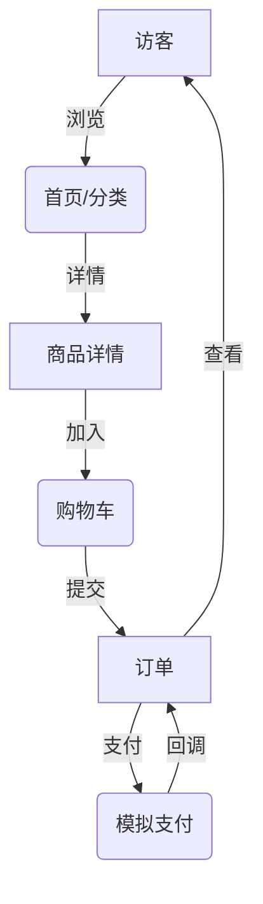

# 商城系统需求文档（基于 `mall` 源码）

> 文档版本：v1.0  
> 生成日期：2026-01-02  
> 适用代码仓库：mall-master（Spring Boot 1.5.8）

本需求文档完全依据实际源码结构、实体模型及控制器路由编写，确保所述范围与实现一致。

---

## 1. 项目概述
商城系统提供一个 B2C 单商户电子商务解决方案，包含前台商城与后台运营两大子系统。系统采用 JPA + Thymeleaf 的 MVC 单体架构，支持商品浏览、购物车、下单支付、订单跟踪以及后台的 CRUD 运维能力。

## 2. 需求分析
### 2.1 业务背景与目标
当下中小企业快速进入电商渠道的诉求强烈，但市面 SaaS 平台收费高且定制化受限；本系统旨在提供一套开源、自部署的 B2C 电商骨架，帮助企业快速构建线上商城。

核心目标：
1. 用户可在 5 分钟内完成注册并成功下单；
2. 运营人员可在 3 步之内完成商品上架；
3. 系统单机支持 ≥200 并发浏览、≥20 并发下单。

### 2.2 业务流程概览


### 2.3 约束与假设
- 仅支持单商户模式，不区分店铺；
- 支付、物流为模拟流程；
- 系统部署于内网，无公网文件上传风险。

### 2.4 风险与缓解
| 风险 | 等级 | 缓解措施 |
|------|------|-----------|
| 高并发秒杀 | 中 | Redis + 队列预留扩展位 |
| SQL 注入 | 中 | JPA 预编译、输入校验 |
| 文件上传滥用 | 低 | 大小 & 扩展名限制 | 

## 3. 系统角色
1. **游客**：未登录状态浏览商品、查看首页与分类页。
2. **普通用户**：注册/登录后可执行购物车、下单、支付、查看订单、确认收货等操作。
3. **后台管理员**：登录后台后进行商品、分类、订单、用户的维护与运营。

## 4. 功能范围
商城系统整体功能归纳为前台商城门户与后台运营管理两大子系统：

**前台（Mall Portal）**：面向终端消费者，围绕“逛—选—购—付—收”购物全流程实现首页展示、商品多维浏览、购物车管理、下单与模拟支付、订单追踪以及账户信息维护等功能，为用户提供顺畅的线上购物体验。

**后台（Admin Console）**：面向运营及客服人员，提供商品、分类、订单、用户等核心业务对象的增删改查（CRUD）与流程驱动能力，包括价格调整、库存维护、订单发货、售后处理以及基础数据统计，帮助运营人员高效管理日常业务。

下文基于实际 Controller / Service 实现对各模块进行逐项说明。

### 4.1 前台功能 (`priv.jesse.mall.web.user`)
| 功能 | 详细说明 | 入口 / 接口 |
|------|----------|-------------|
| 首页 | 首页静态内容展示、热门商品和最新商品组件 | `IndexController` → `/index.html` |
| 用户注册 | 输入用户名、密码、联系方式，唯一性校验 | `UserController.toRegister` `/user/toRegister.html`<br>提交 `/user/register.do` |
| 用户登录 | 表单登录，成功后 Session 保存 `user` | `/user/toLogin.html` & `/user/login.do` |
| 用户登出 | 清理 Session 并重定向首页 | `/user/logout.do` |
| 用户名检查 | AJAX 检测用户名是否存在 | `/user/checkUsername.do` 返回 `ResultBean<Boolean>` |
| 商品详情 | 根据商品 ID 展示详情页 | `ProductController.toProductPage` `/product/get.html?id=` |
| 商品查询 – 热门 | 查询 `isHot=1` 商品集合 | `/product/hot.do` |
| 商品查询 – 最新 | 分页获取最新上架商品 | `/product/new.do?pageNo=&pageSize=` |
| 分类浏览 | 根据一级或二级分类分页浏览商品 | `/product/category.do`、`/product/categorySec.do` |
| 二级分类列表 | 根据一级分类获取所有二级分类 | `/product/getCategorySec.do` |
| 购物车 – 添加 | 将商品加入购物车（存 Session） | `/product/addCart.do` |
| 购物车 – 移除 | 从购物车删除商品 | `/product/delCart.do` |
| 购物车 – 查看 | 返回 Session 中购物车条目 | `/product/listCart.do` |
| 下单提交 | 依据购物车生成订单（含收货人信息） | `OrderController.submit` `/order/submit.do` |
| 订单列表 | 展示当前登录用户所有订单 | `/order/toList.html` & `/order/list.do` |
| 订单详情 | 查询指定订单的订单项 | `/order/getDetail.do` |
| 订单支付 | 调用 `OrderService.pay` 修改状态为已支付 | `/order/pay.do` |
| 订单收货 | 用户确认收货，状态流转至已完成 | `/order/receive.do` |

### 4.2 后台功能 (`priv.jesse.mall.web.admin`)
| 功能 | 详细说明 | 入口 / 接口 |
|------|----------|-------------|
| 管理员登录 | 表单登录、Session 保存 `login_user` | `/admin/toLogin.html` & `/admin/login.do` |
| 首页仪表盘 | 后台首页静态模板 | `/admin/toIndex.html` |
| 用户管理 | 分页查询、编辑、删除用户 | `AdminUserController` 下多接口 |
| 商品管理 | 添加、编辑(含图片上传)、删除、分页查询商品 | `AdminProductController` 下多接口 |
| 商品图片下载 | `/admin/product/img/{filename}` 访问 `file/` 目录 | |
| 分类管理 | 一级、二级分类增删改查与分页 | `AdminClassificationController` |
| 订单管理 | 分页查询订单、查看明细、发货 | `AdminOrderController` |

### 4.3 通用与系统功能
| 组件 | 作用 | 说明 |
|-------|------|------|
| 统一返回 `ResultBean<T>` | 前后端通信包装类 | `entity.pojo` 包 |
| AOP 日志 | 请求/响应日志切面 | `WebLogAspect` |
| 全局异常处理 | 捕获业务异常并跳转 `error.html` | `GlobalExceptionHandler` |
| 登录过滤器 | 拦截后台 & 用户敏感 URI，校验 Session | `AuthorizationFilter` |
| DES 加密工具 | 用户密码加密存储 | `utils.DesUtil` |
| 文件存储工具 | 保存上传商品图片到 `file/` 目录 | `utils.FileUtil` |

## 5. 实体与状态
### 5.1 主要实体
| 实体 | 字段摘要 |
|------|---------|
| User | id, username, password, name, phone, email, addr |
| Product | id, title, marketPrice, shopPrice, image, desc, isHot, csid, pdate |
| Classification | id, parentId, cname, type(1 一级/2 二级) |
| Order | id, uid, total, state (0待付款/1已付款/2已发货/3已完成), address, createTime |
| OrderItem | id, pid, oid, count, subtotal |
| AdminUser | id, username, password |

### 5.2 订单状态流转
0 待付款 → 1 已付款（`pay.do`）→ 2 已发货（后台 `send.do`）→ 3 已完成（用户 `receive.do`）

## 6. 页面/模板结构
前台模板位于 `src/main/resources/templates/mall`，后台位于 `templates/admin`。

## 7. 非功能需求
- 会话管理：HTTP Session，失效时间 30 分钟。
- 上传限制：单文件 ≤ 2 MB，存储根目录 `/file`。
- 浏览器兼容：Chrome/Edge 最新版。
- 并发性能：单实例支持 200 并发用户浏览、20 并发下单。

## 8. 鲁棒性设计与风险控制
系统在安全性、稳定性和数据一致性方面采用多层防护策略，以下列举关键风险点、对应解决方案及核心实现片段。

### 8.1 输入校验与异常处理
所有 Controller 抛出的运行时异常都会被 `GlobalExceptionHandler` 捕获，避免敏感栈信息泄漏并返回统一结构。

```java
@ControllerAdvice
public class GlobalExceptionHandler {
    @ExceptionHandler(value = Exception.class)
    @ResponseBody
    public ResultBean<String> defaultErrorHandler(HttpServletRequest req, Exception e) {
        LOGGER.error(e.getMessage(), e);      // 1) 记录完整堆栈
        return new ResultBean<>("服务器内部错误"); // 2) 返回脱敏信息
    }
}
```
**效果**：任何非法参数、空指针等异常均被统一返回 `ResultBean`，前端可依据 `code` 字段做降级处理。

### 8.2 身份鉴权与会话隔离
后台与前台均通过 `AuthorizationFilter` 校验 Session 中的登录态，防止未授权访问。

```java
private void processAccessControl(HttpServletRequest req, HttpServletResponse res, FilterChain chain)
        throws IOException, ServletException {
    Object adminUser = req.getSession().getAttribute("login_user");
    Object user      = req.getSession().getAttribute("user");
    if (req.getRequestURL().toString().contains("admin")) {
        if (adminUser == null) {
            res.sendRedirect("/mall/admin/toLogin.html");
            return;
        }
    } else if (user == null) {
        res.sendRedirect("/mall/user/toLogin.html");
        return;
    }
    chain.doFilter(req, res);
}
```
**补充措施**：Filter 首先放行静态资源及公开接口 (`login.do`/`register.do` 等)，其余请求一律校验会话。

### 8.3 密码安全与存储
用户及管理员密码在数据库中经过 DES 对称加密；调用位置：注册、登录逻辑。

```java
public static String encrypt(String data, String key) throws Exception {
    byte[] bt = encrypt(data.getBytes(), key.getBytes());
    return new BASE64Encoder().encode(bt);
}
```

> 当前为示例实现，生产环境推荐升级为 BCrypt/SHA-256 + 盐，同时删除 `sun.misc` 依赖。

### 8.4 文件上传安全
`FileUtil.saveFile` 对上传文件进行以下处理：
1. **空文件检查**；
2. **目录隔离**；
3. **MD5 命名**；
4. **后缀验证**；

```java
String fileName = md5 + "." + getPostfix(originalFilename);
Files.write(Paths.get(file1.toURI()), file.getBytes(), StandardOpenOption.CREATE_NEW);
```

### 8.5 跨域与响应头
```java
response.setHeader("Access-Control-Allow-Origin", "*");
response.setHeader("Access-Control-Allow-Methods", "POST, GET, OPTIONS, DELETE");
```

### 8.6 日志追踪与监控
- `WebLogAspect` 记录请求/响应；
- `logback.xml` 滚动输出；

### 8.7 数据一致性
```java
@Transactional
public void submit(...) {
    orderDao.save(order);
    orderItemDao.save(itemList);
}
```

### 8.8 并发与性能
- 购物车存储于 Session，避免 DB 写热点；
- 热门/最新商品查询使用分页 `PageRequest` 限制一次性加载。

### 8.9 典型异常/可疑操作场景处理
| 场景 | 系统防护/处理 | 关键实现 |
|------|--------------|---------|
| 未登录用户访问受限页面 | `AuthorizationFilter` 判断 Session 中 `user` / `login_user`，自动 302 到登录页 | 见 `processAccessControl` 代码块上方示例 |
| 伪造订单号支付 | `OrderService.pay` 调用 `orderDao.findOne` 校验订单存在性，若为空抛出 `RuntimeException` 被全局异常捕获 | `if(order==null) throw new RuntimeException("订单不存在");` |
| 重复点击提交订单 | `submit` 方法使用 `@Transactional`，且前端跳转列表页；如第二次提交同一 Session 购物车已清空将返回空列表 | 见 `OrderServiceImpl.submit` |
| SQL 注入尝试（如搜索框传入 `' OR 1=1`） | 所有查询使用 JPA Repository / Criteria，不拼接原生 SQL | 示例 `productService.findByCid(cid, pageable)` |
| 超过大小或空文件上传 | `FileUtil.saveFile` 先检查 `file.isEmpty()`，触发 `MultipartException` 时被 GlobalExceptionHandler 捕获 | `if(file==null || file.isEmpty()) return "";` |
| 批量爬虫或恶意刷接口 | `WebLogAspect` 统计调用频次，可在 `LOGGER` 输出中接入报警；后续可接入 Nginx/Lua 限流 | AOP 切面收集 URI & 耗时 |
| 参数篡改（如修改商品价格） | 价格以后台存储为准，前端只传商品 ID；结算阶段重新查询数据库并计算 `subTotal` | `orderItem.setSubTotal(product.getShopPrice()*count)` |
| XSS 攻击 | 前端模板采用 Thymeleaf 默认 HTML 转义，后台输出 `ResultBean` 不携带富文本 | Thymeleaf `th:text` 默认转义 |

### 8.10 未来改进
| 风险 | 当前方案 | 待提升 |
|------|----------|-------|
| 密码加密 | DES | BCrypt + 盐 |
| CSRF | 同源策略 | 引入 CSRF Token |
| 秒杀 | 本地事务 | Redis 队列 + 乐观锁 |

---

> 文档完。后续功能变更请同步更新此文件。
